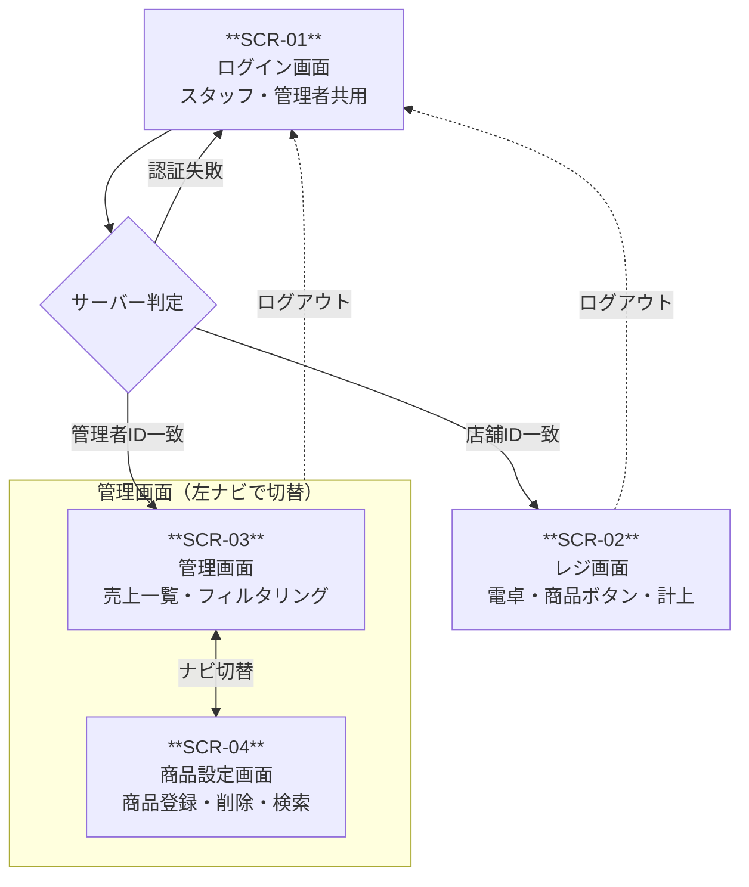
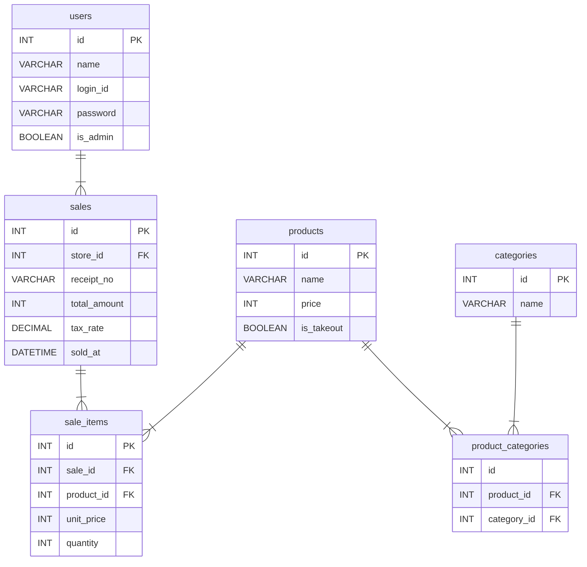

# 基本設計書（Next.js版）

> **注記：** このドキュメントはチーム開発版（PHP + Laragon）の基本設計書 v1.0 をベースに、個人練習・卒業制作本番を想定してNext.js用に技術スタック・ルーティング・ディレクトリ構成を差し替えたものです。変更箇所以外は原本と同一です。
> 

<!-- 変更 2026-05-07 バージョン1.1→1.2、更新日を反映 -->
**バージョン：** 1.2（Next.js版）

**作成日：** 2026/04/24

**更新日：** 2026/05/07

**ステータス：** 作成中

<!-- 追記 2026-05-07 v1.2 変更履歴 -->
### v1.2 変更履歴

- ルーティング設計および認証ガード規約：Next.js 16 で `middleware` 規約が deprecated となったため、`proxy` 規約に置き換え
- ディレクトリ構成：Docker 開発環境を構築（`Dockerfile` / `docker-compose.yml` / `.dockerignore`）に伴い、対応するファイルを追記

---

## 画面一覧整理

| 画面ID | 画面名 | 主な機能 | 遷移元 | 遷移先 | 優先度 |
| --- | --- | --- | --- | --- | --- |
| **SCR-01** | ログイン画面 | スタッフ用・管理者用ログインフォーム（店舗ID・PW or 管理ID・PW） | なし（エントリポイント） | SCR-02（スタッフログイン成功）、SCR-03（管理者ログイン成功） | P1 |
| **SCR-02** | レジ画面 | 電卓操作・商品ボタン（カテゴリ別・TO/店内）・注文明細・お釣り計算・計上モーダル | SCR-01（スタッフログイン成功） | SCR-01（ログアウト） | P1 |
| **SCR-03** | 売上管理画面 | 売上一覧（店舗・カテゴリ・日付・会計番号で絞込）・絞込合計金額・絞込レコード数表示 | SCR-01（ログイン成功）、SCR-04 ナビ | SCR-04（ナビ切替）、SCR-01（ログアウト） | P2 |
| **SCR-04** | 商品設定画面 | 商品登録フォーム（商品名・金額・カテゴリ・TO区分）／商品一覧（店舗・カテゴリでフィルタ・商品名検索）／削除 | SCR-03ナビ | SCR-03（ナビ切替）、SCR-01（ログアウト） | P1 |

---

## 画面遷移図



---

## ルーティング設計

### 画面ルート（page.tsx）

| 画面ID | 画面名 | URL | 説明 |
| --- | --- | --- | --- |
| SCR-01 | ログイン画面 | `/` | トップページ兼ログインフォーム。未認証ユーザーのエントリポイント |
| SCR-02 | レジ画面 | `/register` | スタッフ用。未認証または管理者ロールならトップへリダイレクト |
| SCR-03 | 管理画面（売上） | `/admin` | 管理者用。未認証またはスタッフロールならトップへリダイレクト |
| SCR-04 | 商品設定画面 | `/admin/products` | 管理者用。SCR-03と左ナビで切替 |

<!-- 変更 2026-05-07 Next.js 16 で middleware 規約は deprecated。proxy 規約に変更 -->
> **認証ガードについて：** ロールに応じたリダイレクトは `proxy.ts` で一元管理する。各 `page.tsx` に認証チェックを書かない。
> 

### APIルート（route.ts）

| 機能 | URL | HTTPメソッド | 説明 |
| --- | --- | --- | --- |
| ログイン・ログアウト処理 | `/api/auth/[...nextauth]` | GET / POST | Auth.jsが担当。セッション管理・リダイレクトを自動処理 |
| 商品一覧取得 | `/api/products` | GET | レジ画面・商品設定画面で使用 |
| 商品登録 | `/api/products` | POST | 商品登録フォームの送信先 |
| 商品編集 | `/api/products/[id]` | PUT | 登録済み商品の編集 |
| 商品削除 | `/api/products/[id]` | DELETE | 削除ボタンの送信先 |
| 売上一覧取得 | `/api/sales` | GET | 管理画面の売上一覧表示 |
| 計上処理 | `/api/sales` | POST | レジ画面の計上ボタン送信先 |

---

## ディレクトリ構成

```markdown
cheers_yse_pos/
│
├── app/                              # 画面ルート（PHPのpublic/ + views/ に相当）
│   ├── page.tsx                      # SCR-01 ログイン画面
│   ├── layout.tsx                    # ルートレイアウト（共通ヘッダー等）
│   │
│   ├── register/
│   │   └── page.tsx                  # SCR-02 レジ画面
│   │
│   ├── admin/
│   │   ├── page.tsx                  # SCR-03 売上管理画面
│   │   ├── layout.tsx                # 管理画面共通レイアウト（左ナビ）
│   │   └── products/
│   │       └── page.tsx              # SCR-04 商品設定画面
│   │
│   └── api/                          # APIエンドポイント（PHPのPOST受け口に相当）
│       ├── auth/
│       │   └── [...nextauth]/
│       │       └── route.ts          # Auth.js エンドポイント（ログイン・ログアウト処理）
│       ├── products/
│       │   ├── route.ts              # GET（一覧取得）/ POST（商品登録）
│       │   └── [id]/
│       │       └── route.ts          # PUT（商品編集）/ DELETE（商品削除）
│       └── sales/
│           └── route.ts              # GET（売上一覧）/ POST（計上処理）
│
├── lib/                              # ビジネスロジック（PHPのsrc/ に相当）
│   ├── db.ts                         # Prismaクライアント（Database.phpに相当）
│   ├── auth.ts                       # Auth.js設定（Auth.phpに相当）
│   └── validations/                  # zodバリデーションスキーマ
│       ├── product.ts                # 商品登録・編集のバリデーション
│       └── sale.ts                   # 計上処理のバリデーション
│
├── prisma/
│   └── schema.prisma                 # テーブル定義・ER図に相当（マイグレーション管理）
│
├── proxy.ts                          # 認証ガード・ロール別リダイレクト（全ルート共通） <!-- 変更 2026-05-07 middleware.ts → proxy.ts (Next.js 16) -->
│
├── Dockerfile                        # Next.js開発用コンテナ定義 <!-- 追記 2026-05-07 Docker環境構築 -->
├── docker-compose.yml                # db + app の2サービス定義 <!-- 追記 2026-05-07 Docker環境構築 -->
├── .dockerignore                     # Dockerビルド時の除外設定 <!-- 追記 2026-05-07 Docker環境構築 -->
├── .env.local                        # 環境変数（Git管理外・.gitignoreに必ず追加）
└── .gitignore
```

---

## 概念設計

| エンティティ | 属性 | 備考 |
| --- | --- | --- |
| users | 名前・ログインID・パスワード・ロール | 認証用データ。店舗ごとに1アカウント + 管理者用のアカウント（ロールで分類） |
| **products**（商品） | 商品名・価格・TO区分 | 商品マスタ。店舗・カテゴリとは独立して管理 |
| **categories**（カテゴリ） | カテゴリ名 | 表記ゆれ防止のため独立したテーブルで管理 |
| **store_products**（店舗×商品） | 店舗ID・商品ID | 店舗と商品の多対多を解決するマッピングテーブル |
| **product_categories**（商品×カテゴリ） | 商品ID・カテゴリID | 商品とカテゴリの多対多を解決するマッピングテーブル |
| **sales**（売上） | 会計日時・合計金額・税率・伝票番号・店舗ID | 1回の会計全体を表すヘッダー |
| **sale_items**（売上明細） | 会計ID・商品ID・商品名・単価・個数 | 会計に含まれる商品ごとの明細行。商品名・単価は売上時点の値を保持 |

### リレーションシップ

- 店舗 1対多 店舗×商品（1つの店舗は複数の商品を扱う）
- 商品 1対多 店舗×商品（1つの商品は複数の店舗で扱われる）
- 商品 1対多 商品×カテゴリ（1つの商品は複数のカテゴリに属する）
- カテゴリ 1対多 商品×カテゴリ（1つのカテゴリは複数の商品を持つ）
- 店舗 1対多 売上（1つの店舗は複数の会計を持つ）
- 売上 1対多 売上明細（1つの会計は複数の明細行を持つ）
- 商品 1対多 売上明細（1つの商品は複数の会計明細に登場する）

---

## 論理設計（ERD）



### 型選定の根拠

| カラム | 型 | 根拠 |
| --- | --- | --- |
| `price` `unit_price` `total_amount` | INT | 金額は円単位の整数で管理。小数点以下はアプリ層で丸めてから保存し、計算誤差の蓄積を防ぐ |
| `tax_rate` | DECIMAL | 8%・10%の小数を正確に保持するため。FLOATは2進数近似値のため税率には不使用 |
| `receipt_no` | VARCHAR | 将来的に「2026-0042」のような文字列形式にも対応できる余地を残すため |
| `is_takeout` | BOOLEAN | テイクアウト可否はtrue/falseの2値で表現。PrismaではBooleanとして扱われる |
| `product_name` `unit_price`（sale_items） | VARCHAR / INT | 売上時点の商品名・価格を記録として固定する。商品マスタの変更が過去の売上に影響しないよう保証するため |

---

## 技術スタック

| 項目 | 内容 |
| --- | --- |
| フロントエンド | Next.js + TypeScript |
| バックエンド | Next.js API Routes（モノレポ構成） |
| データベース | PostgreSQL + Prisma |
| 認証 | Auth.js |
| 開発環境 | Docker + docker-compose / VSCode |
| デプロイ | Vercel + Supabase |
| 動作ブラウザ | Google Chrome |

---

## 全画面の共通処理

- DB接続の共通化方針
- 認証ガード
- セッション管理の方針